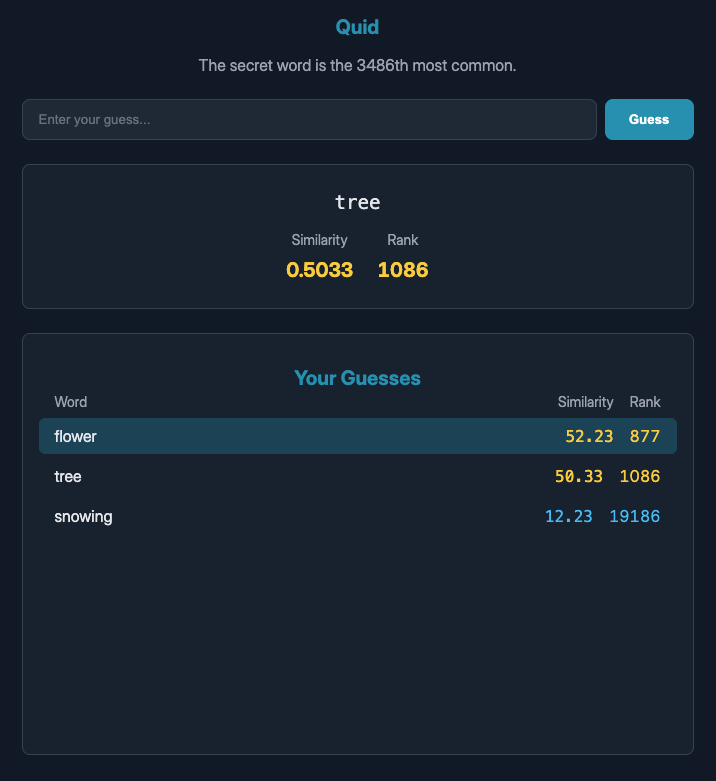

#  Quid - A Semantic Word Game

Quid is a word-guessing game where you must find a secret word based on its semantic meaning. Unlike traditional word games that rely on spelling, Quid uses word embeddings to measure how close your guesses are in meaning to the target word.

Yes, this is inspired by [_Semantle_](https://en.wikipedia.org/wiki/Semantle) and similar variants.

The game challenges your intuition about word relationships. How "close" is _king_ to _queen_? What about _king_ to _throne_? Or _king_ to _power_? Put your vocabulary to the test and see if you can navigate the vector space to find the secret word.

## Features

- **Semantic Gameplay**: The core mechanic is based on cosine similarity between GloVe word vectors, not spelling.
- **Instant Feedback**: Each guess provides a similarity score and a rank, telling you exactly how close you are among all possible words.
- **Strategic Hints**: The game reveals the secret word's frequency rank and highlights your guesses that fall within the top 1000 closest words.
- **Sorted Guess History**: Keep track of your previous guesses, automatically sorted by similarity, to help you refine your strategy.
- **Fast & Lightweight**: Uses a quantized and pruned set of GloVe vectors to run efficiently and entirely in the browser.
- **PWA Ready**: Installable on your home screen for a native app-like experience, and cached for offline use.

## How to Play

The objective is to find the secret word in as few guesses as possible.

1.  **Start a Game**: The computer selects a secret word from the 20,000 most common English words and tells you its frequency rank (e.g., "The secret word is the 548th most common.").
2.  **Make a Guess**: Enter any word into the input box.
3.  **Analyze the Feedback**:
    - **Similarity**: A score from 0 to 1 indicating how semantically close your word is to the secret one. A higher score is better.
    - **Rank**: Your word's position if all words in the dictionary were sorted by their similarity to the secret word. Your goal is to get to rank #1.
4.  **Refine and Repeat**: Use the feedback to make another guess. If "car" gives you a high score, try related words like "drive", "road", or "engine". The guess history, sorted by similarity, will help you track which paths are getting you "warmer".
5.  **Win**: When you guess the secret word, its rank will be #1, and the game will end. Then you can play again.

## Under the Hood

Quid's logic is powered by **GloVe (Global Vectors for Word Representation)**, a popular set of word embeddings.

- **Word Vectors**: Each word in the game's dictionary is represented as a 50-dimensional vector. Words with similar meanings are located closer to each other in this vector space.
- **Cosine Similarity**: The "closeness" between your guess and the secret word is calculated using the [cosine similarity](https://en.wikipedia.org/wiki/Cosine_similarity) between their respective vectors. This measures the cosine of the angle between them, providing a normalized score of their semantic relationship.
- **Performance**: To make the game playable in a web browser, the original GloVe vectors are first reduced to 50000 top English words, and then quantized (converting floating-point numbers to integers) to significantly reduce the data file size, which is de-quantized on the fly during the initial load.

---

---

## Credits

- **Word Vectors**: Based on the [GloVe: Global Vectors for Word Representation](https://nlp.stanford.edu/projects/glove/) project by the Stanford NLP Group.
- **Development**: Initial concept and code structure developed with assistance from Google's Gemini.
